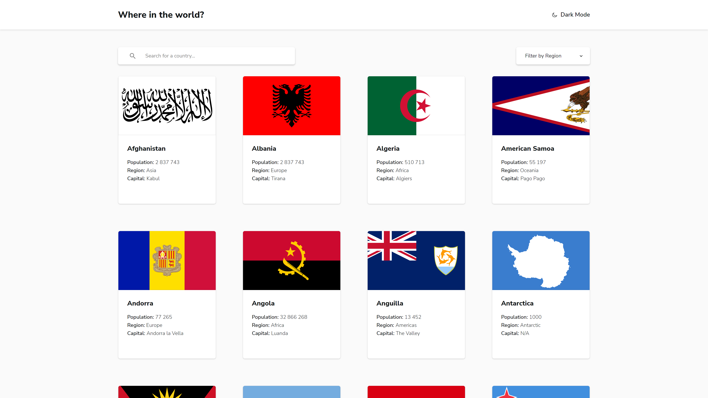

# Frontend Mentor - REST Countries API with color theme switcher solution

This is a solution to the [REST Countries API with color theme switcher challenge on Frontend Mentor](https://www.frontendmentor.io/challenges/rest-countries-api-with-color-theme-switcher-5cacc469fec04111f7b848ca). Frontend Mentor challenges help you improve your coding skills by building realistic projects.

## Table of contents

- [Overview](#overview)
  - [The challenge](#the-challenge)
  - [Screenshot](#screenshot)
  - [Links](#links)
- [My process](#my-process)
  - [Built with](#built-with)
  - [What I learned](#what-i-learned)
  - [Useful resources](#useful-resources)
- [Author](#author)

## Overview

### The challenge

Users should be able to:

- See all countries from the API on the homepage
- Search for a country using an `input` field
- Filter countries by region
- Click on a country to see more detailed information on a separate page
- Click through to the border countries on the detail page
- Toggle the color scheme between light and dark mode _(optional)_

### Screenshot

### Links

- [Live Site Previes](https://mieszkokowalik-rest-coutries.netlify.app/)

## My process

### Built with

- [React](https://reactjs.org/)
- [React Router](https://reactrouter.com/)
- [Create React App](https://create-react-app.dev/)
- [Styled Components](https://styled-components.com/)
- [Atomic Design](https://bradfrost.com/blog/post/atomic-web-design/)
- [Jest](https://jestjs.io/)
- [React Testing Library](https://testing-library.com/docs/react-testing-library/intro)
- [Storybook](https://storybook.js.org/)
- [Downshift js](https://www.downshift-js.com/)
- [REST Countries API](https://restcountries.com/#rest-countries)
- Mobile-first workflow
- Semantic HTML5 markup
- Flexbox
- CSS Grid

### What I learned

- Building a user friendly dark mode. In this project dark mode is based on 3 factors:

  - users OS prefered color scheme
  - `local storage` object that stores preffered theme
  - user can switch the theme using a checkbox theme toggler.

- Using Storybook - Storybook helps you document components for reuse and automatically visually test your components to prevent bugs. In this case I have used it as a tool to develop components without the need of puting them somwhere on the page.
- Writing tests - With this project I wanted to get into the world of testing. I wrote few simple test just to get a grip on it.

### Useful resources

- [CSS Tricks - Complete Guide to Dark Mode](https://css-tricks.com/a-complete-guide-to-dark-mode-on-the-web/)
- [Downshift-js useSelect](https://www.downshift-js.com/use-select) - A custom hook that allows to build a custom select that follows the ARIA design pattern.
- [Netlify redirects](https://docs.netlify.com/routing/redirects/)

## Author

- Frontend Mentor - [@MieszkoKowalik](https://www.frontendmentor.io/profile/MieszkoKowalik)
